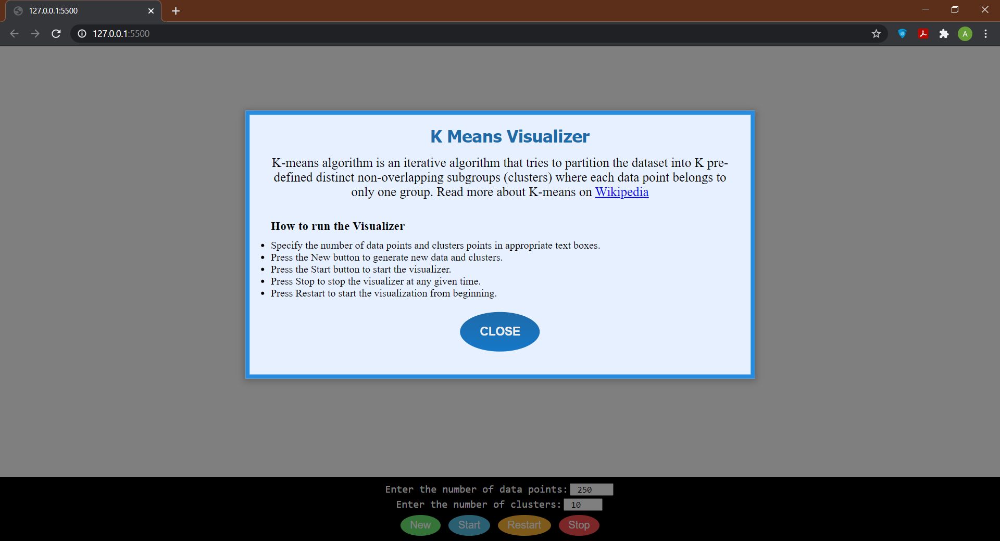
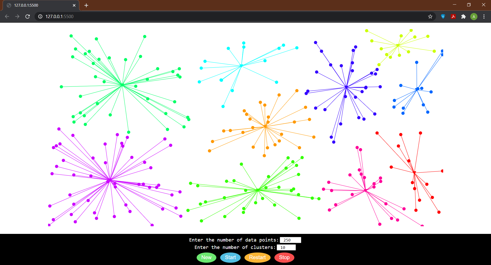

# K-Means Clusterring Visualizer

> K-means algorithm is an iterative algorithm that tries to partition the dataset into K pre-defined distinct non-overlapping subgroups (clusters) where each data point belongs to only one group.

Created an application visualizing the K-Means CLustering using basic **HTML**, **CSS**, **JS** and a JS library **D3JS** for visualization.
It takes input -> Number of data points(min-2 and max-250) and Number of clusters to be formed(min-2 and max-50).

### How to use:-

- Specify the number of data points and clusters points in appropriate text boxes.
- Press the New button to generate new data and clusters.
- Press the Start button to start the visualizer.
- Press Stop to stop the visualizer at any given time.
- Press Restart to start the visualization from beginning.

### Screenshots:-

